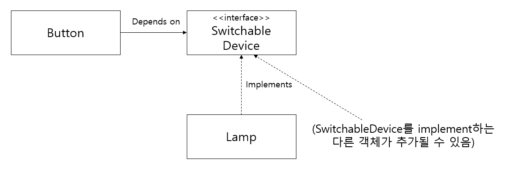
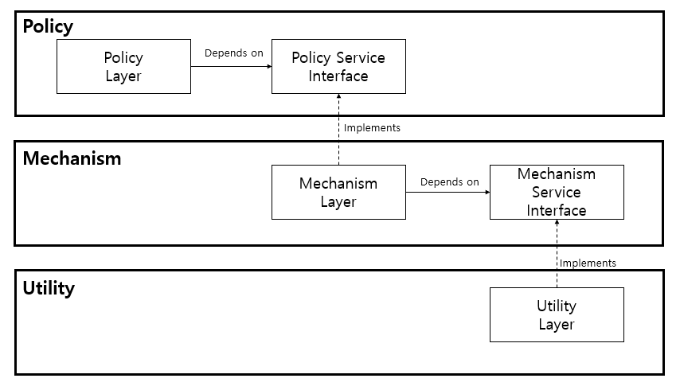
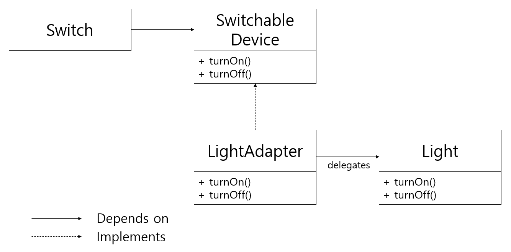

## ABSTRACT SERVER 패턴

ABSTRACT SERVER 패턴은 디자인 패턴 가운데 가장 단순한 패턴으로, DIP를 지키기 위해 가장 첫 번째로 적용해볼 수 있는 방법이다. 이전의 숱한 예시에서도 익숙하게 사용해 왔던 방식인데, 상위 모듈이 구체적인 하위 모듈에 의존하도록 하지 않고 사이에 인터페이스를 하나 두어 추상화에 의존하도록 하는 것이다.

### 인터페이스의 소유자

DIP에서도 설명했듯이, ABSTRACT SERVER는 보통 이를 구현하는 클래스와 함께 묶이기 보다는 이를 사용하는 클라이언트와 함께 묶이는 경향을 보인다. 즉 클라이언트가 인터페이스를 소유할 가능성이 높다.

이러한 경향은 효율적인 패키지 관리 전략 설정에 중요한 도움을 줄 수도 있다. 

## ADAPTER 패턴

위 구조의 한 가지 문제점은, Lamp 객체가 SwitchableDevice 인터페이스와 강력하게 결합된다는 것이다. Switch로 제어하고 싶은 Light 객체가 있는데, 이 객체는 서드파티에서 사온 것이라 SwtichableDevice에서 파생될 수 없다고 해보자. 이런 경우에 ADAPTER 패턴을 적용하기에 적절하다.

Switch로 제어하고 싶은 구체적인 클래스가 SwitchableDevice를 직접 구현하도록 하지 않고, 중간에 LightAdapter 객체를 하나 두어 이 객체가 SwitchableDevice를 구현하도록 한다. 그리고 실제 동작은 구체적인 클래스(Light, Lamp 등)에게 모두 위임한다.

### ADAPTER 패턴의 효용

ADAPTER 패턴은 문제를 멋지게 해결하지만, 꽤 많은 비용을 수반한다. 대부분의 경우는 ABSTRACT SERVER만으로 충분할 것이다.